# 🌍 Earthquake Prediction using Machine Learning

This project focuses on predicting earthquake magnitude using Machine
Learning models based on historical earthquake data.

The goal is to analyze seismic data and build predictive models that
help understand earthquake patterns and potential future activity.

------------------------------------------------------------------------

# 📌 Project Overview

Earthquakes are natural disasters that can cause severe damage to
infrastructure and loss of life. Predicting earthquake patterns helps
researchers and governments prepare early warning systems and disaster
management strategies.

This project uses Machine Learning techniques to analyze historical
earthquake data and predict earthquake magnitude.

------------------------------------------------------------------------

# 📂 Dataset

The dataset used in this project is the SOCR Earthquake Dataset.

Dataset Source\
http://socr.ucla.edu/docs/resources/SOCR_Data/SOCR_Data_Earthquakes_Over3.html

### Dataset contains information such as:

-   Date and time of earthquake
-   Latitude and Longitude
-   Depth of earthquake
-   Earthquake Magnitude
-   Number of monitoring stations
-   Distance to nearest station
-   RMS residual
-   Azimuthal gap

### Dataset details

-   Region: California, United States
-   Time period: 2017 -- 2019
-   Total earthquake records: 37,706 events
-   Magnitude: 3.0 and above

------------------------------------------------------------------------

# 📊 Exploratory Data Analysis

Data visualization was performed using Tableau and Python libraries to
understand earthquake patterns.

The visualizations help identify relationships between:

-   Magnitude
-   Depth
-   Monitoring stations
-   Time trends
-   Geographic distribution

------------------------------------------------------------------------

# 🧩 Class Diagram

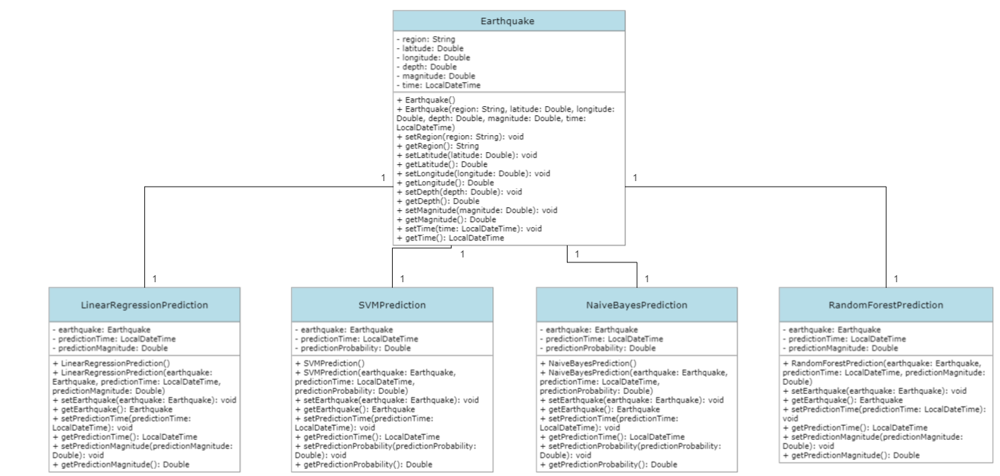

------------------------------------------------------------------------

# 📊 Data Visualization

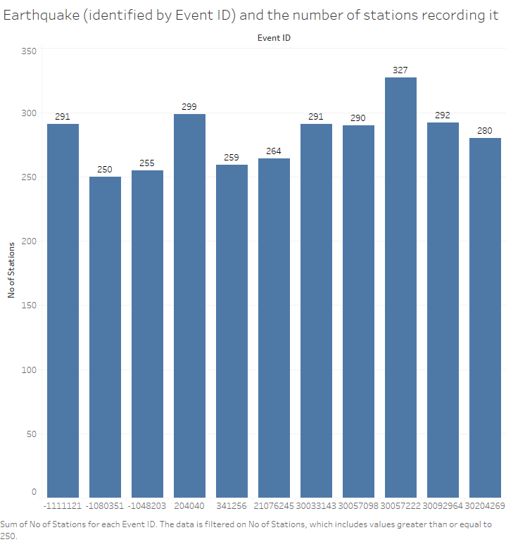

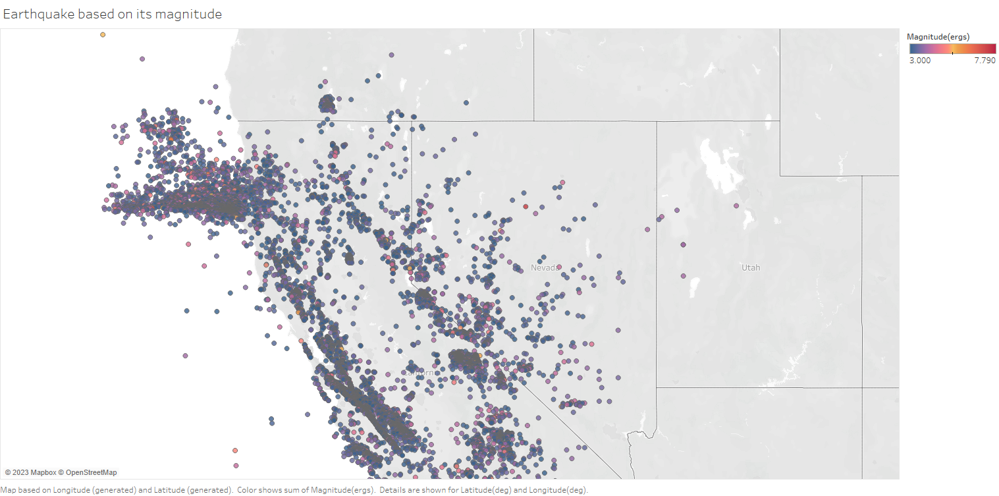

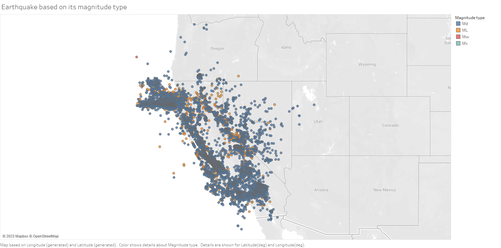

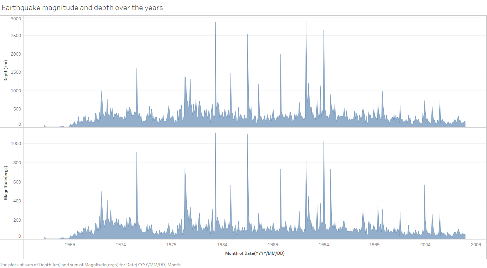

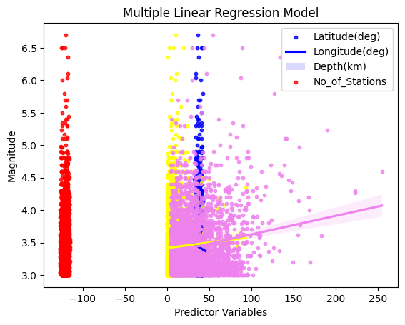

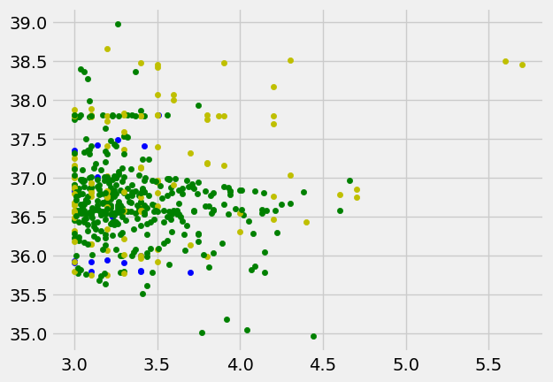

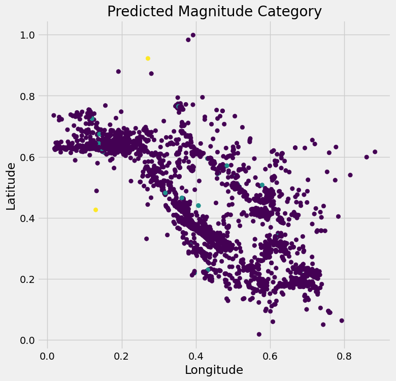

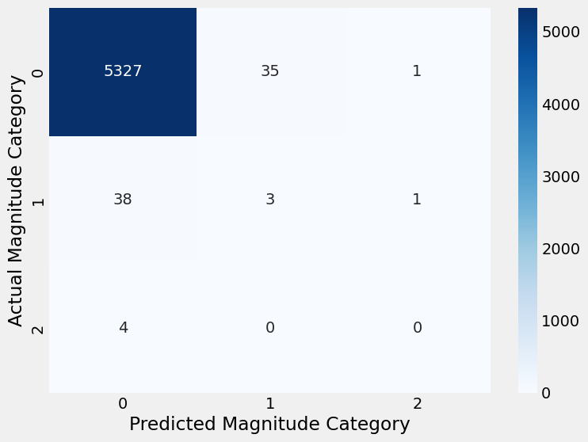

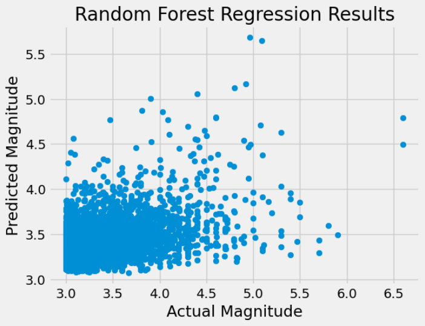

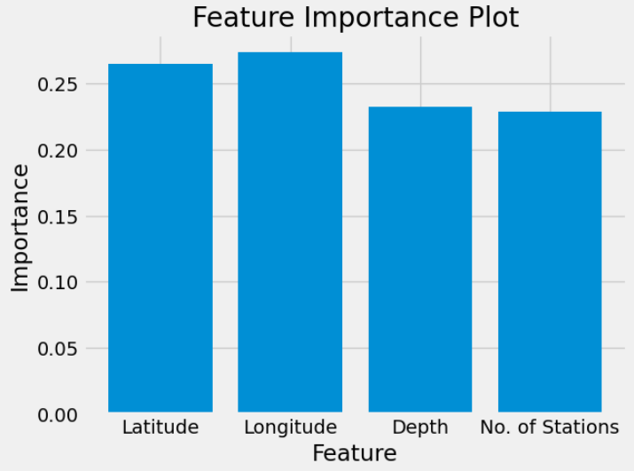

------------------------------------------------------------------------

# ⚙️ Machine Learning Models Used

The following models were used to predict earthquake magnitude:

-   Linear Regression
-   Support Vector Machine (SVM)
-   Naive Bayes
-   Random Forest

------------------------------------------------------------------------

# 📉 Linear Regression

Linear Regression is a supervised machine learning algorithm used to understand the relationship between a target variable and several input variables.

In this project, Linear Regression is used to predict earthquake magnitude based on:

### - Latitude

### - Longitude

### - Depth

### - Number of seismic stations

The model finds the best fitting line that represents the relationship between these variables and earthquake magnitude.

After training the model on historical earthquake data, it can be used to predict the magnitude of future earthquakes based on their location, depth, and monitoring station data.

This helps researchers analyze earthquake patterns and improve earthquake monitoring and prediction systems.

### Model Performance

-   Mean Squared Error (MSE): 0.17562
-   R² Score: 0.03498

------------------------------------------------------------------------

# 📉 Support Vector Machine (SVM)

Support Vector Machine (SVM) is a supervised machine learning algorithm used for both classification and regression tasks.

In this project, SVM is used to predict earthquake magnitude based on features such as:

### - Latitude

### - Longitude

### - Depth

### - Number of seismic stations

SVM works by finding the best boundary (hyperplane) that fits the data while maximizing the distance between the boundary and the nearest data points.

For regression problems, SVM creates a regression line that best fits the data while maintaining this margin.

SVM can also handle non-linear data by using kernels such as:

### - Linear kernel

### - Polynomial kernel

### - Radial Basis Function (RBF)

After training, the model can predict earthquake magnitude using the given earthquake features, helping in better analysis and monitoring of earthquake patterns.

### Model Performance

-   Mean Squared Error (MSE): 0.53166
-   R² Score: -1.92129

------------------------------------------------------------------------

# 📉 Naive Bayes

Naive Bayes is a probabilistic machine learning algorithm based on Bayes’ Theorem. It assumes that all input features are independent of each other, which makes the model simple and fast.

In this project, the Naive Bayes classifier is used to predict earthquake magnitude using features such as:

### - Latitude

### - Longitude

### - Number of monitoring stations

The dataset is divided into training and testing sets.
The model is trained on the training data and then evaluated on the test data.

Model performance is measured using:

### - Accuracy Score

### - Confusion Matrix

### - Classification Report

Naive Bayes is known for being efficient, scalable, and capable of producing good results with large datasets.

### Model Results

-   Accuracy: 0.98539

------------------------------------------------------------------------

# 🌲 Random Forest

Random Forest is a machine learning algorithm used for both classification and regression tasks. It is an ensemble method that combines multiple decision trees to produce more accurate predictions.

The model creates many decision trees using different subsets of the data and features. Each tree makes a prediction, and the final result is calculated by averaging the predictions (for regression) or selecting the most common prediction (for classification). This approach helps reduce overfitting and improves model accuracy.

In this project, Random Forest is used to predict earthquake magnitude using features such as:

### - Latitude

### - Longitude

### - Depth

### - Number of monitoring stations

The dataset is split into training and testing sets, and the model is evaluated using:

### - Mean Squared Error (MSE)

### - R-squared (R²) score

Random Forest performed better than the other models, making it the most effective model for this prediction task.

### Model Performance

-   Mean Squared Error (MSE): 0.15599
-   R² Score: 0.14288

------------------------------------------------------------------------

# 📊 Model Comparison

  Model               MSE           R² Score
  ------------------- ------------- -------------
  Linear Regression   0.17562       0.03498
  SVM                 0.53166       -1.92129
  Random Forest       **0.15599**   **0.14288**

Best Performing Model: Random Forest

------------------------------------------------------------------------

# 🧠 Technologies Used

-   Python
-   Scikit-Learn
-   Pandas
-   NumPy
-   Matplotlib
-   Seaborn
-   Tableau

------------------------------------------------------------------------

# 📁 Project Structure

    Earthquake_Prediction-ML
    │
    ├── images/
    │   ├── Class_diagram.png
    │   ├── Data_visualization1.png
    │   ├── Data_visualization2.png
    │
    ├── EDA_J_Component.ipynb
    ├── Earthquake_data_processed.xlsx
    ├── Earthquake_Visualization.twb
    └── README.md

------------------------------------------------------------------------

# 📌 Conclusion

This project demonstrates how Machine Learning models can analyze
earthquake data and predict earthquake magnitude.

Among all models tested:

⭐ Random Forest performed the best.

------------------------------------------------------------------------

# 👨‍💻 Author

Rupesh Desai\
Machine Learning Enthusiast

📧 rupeshdesaiwork@gmail.com\
🔗 https://www.linkedin.com/in/rupeshdesai2010/
